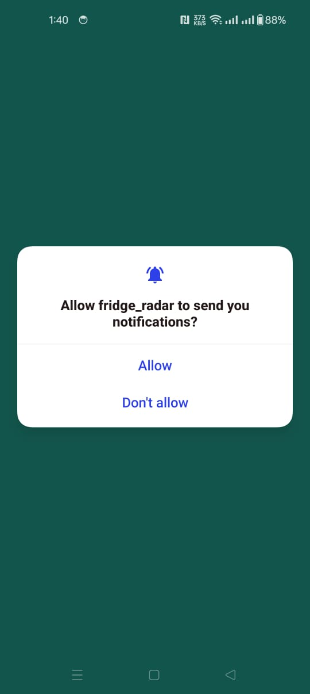
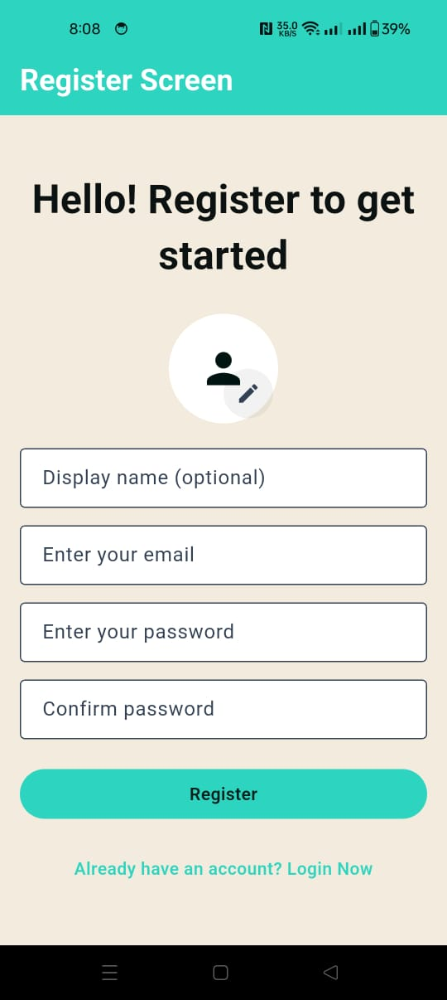
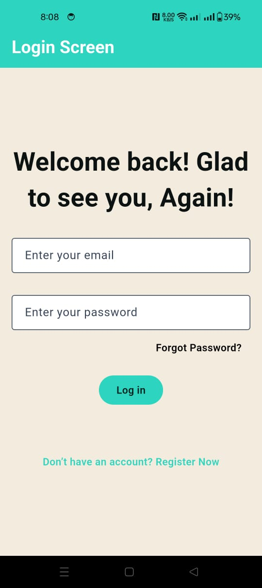
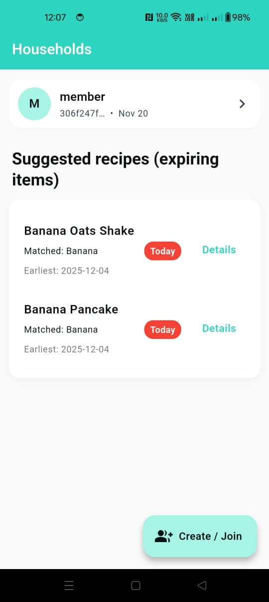
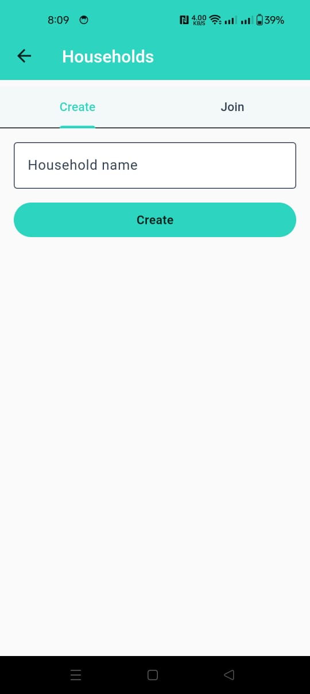
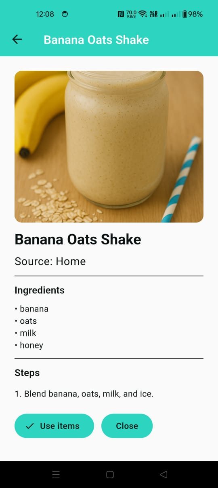
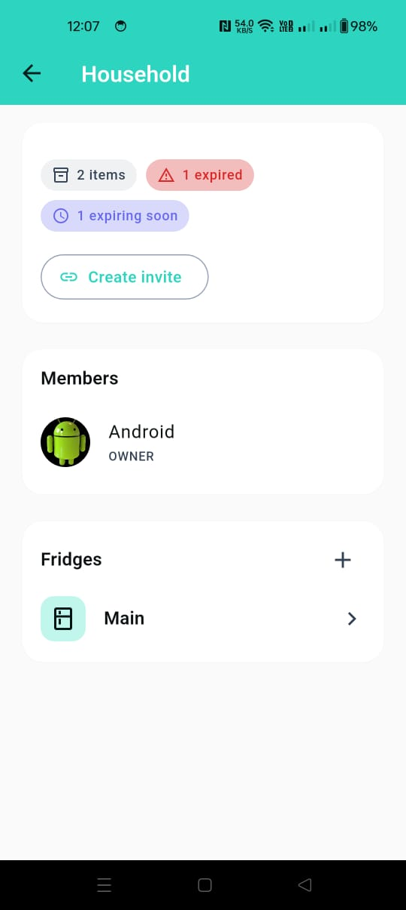
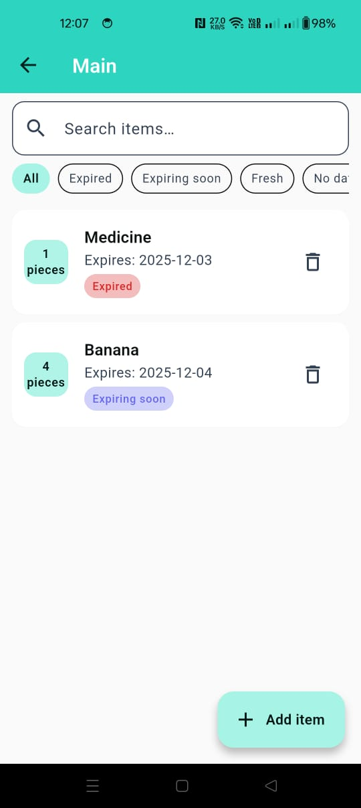
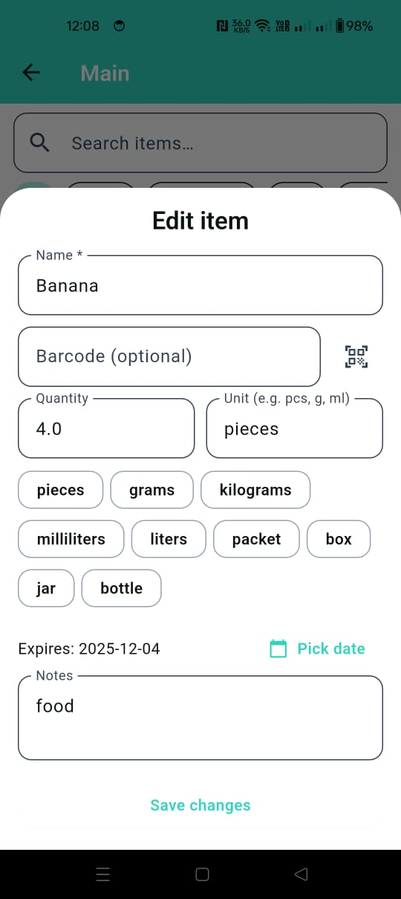

# Fridge Radar — Flutter App

[](https://flutter.dev)
[](https://dart.dev)
[](https://riverpod.dev)
[](https://pub.dev/packages/go_router)
[](https://supabase.com)
[](#)
[](LICENSE)

A smart food-management system that tracks fridge items, monitors expiration dates, suggests recipes, and allows household members to collaborate. Built with Flutter, powered by *Supabase*, and designed using a feature-first clean architecture.

---

## ✨ Highlights

- Email/password authentication with **Supabase**
- **Create / Join** Households
- **Share fridges**  inside each household
- Add, edit, delete items with expiry and quantity
- Smart recipe suggestions based on expiring items
- **Local notifications** for "expiring soon" alerts
- Real-time sync between household members
- Clean, modern Material 3 UI

---

## 📸 Screenshots

> Place the `screenshots/` folder in your repo root so these links work on GitHub.

  

  

  



---
 

---

## 🎥 Demo
<p></p>


## 🧱 Tech Stack

- **Flutter** + **Dart**
- **Riverpod** for state management
- **go_router** for navigation
- **Supabase** for auth, database, and real‑time features

---

## 🚀 Getting Started

### Prerequisites
- Flutter **3.x** and Dart **3.x**
- A Supabase project (obtain **SUPABASE_URL** and **SUPABASE_ANON_KEY**)

### Setup

```bash
# 1) Clone
git clone https://github.com/<your-org>/<your-repo>.git
cd <your-repo>

# 2) Install packages
flutter pub get
```

Create your env/config (choose the style you prefer):

**Option A — Dart constants**
```dart
// lib/core/env.dart
class Env {
  static const supabaseUrl = 'https://YOUR-PROJECT.supabase.co';
  static const supabaseAnonKey = 'YOUR_SUPABASE_ANON_KEY';
}
```

**Option B — .env (with flutter_dotenv)**
```
SUPABASE_URL=https://YOUR-PROJECT.supabase.co
SUPABASE_ANON_KEY=YOUR_SUPABASE_ANON_KEY
```

Then initialize Supabase early (e.g., in `main.dart`).

### Run
```bash
flutter run
```

---


## 📁 Suggested Folder Structure

```
lib/
  common/
  core/
  data/
  features/
  l10n/
  notifications/
  services/
  view_model/
  app.dart
  main.dart

```

---

## 🗺️ Roadmap

- Grocery list integration
- Barcode scanning
- AI-powered recipe suggestions
- OCR expiry date detection
- Offline local history

---

## 🤝 Contributing

PRs are welcome!  
If you spot UI/UX tweaks, accessibility fixes, or performance improvements, please open an issue first to discuss the change.

---

## 📝 License

MIT © 2025-12-04 — Fridge Radar Contributors
