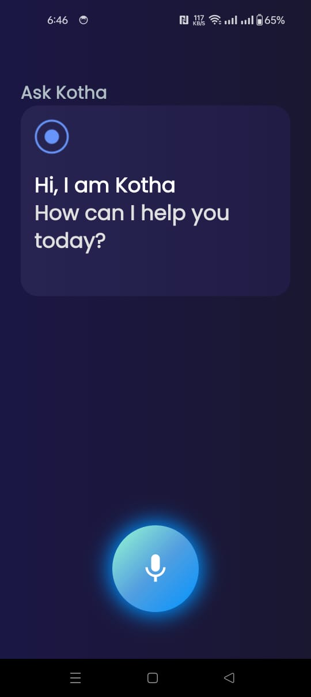
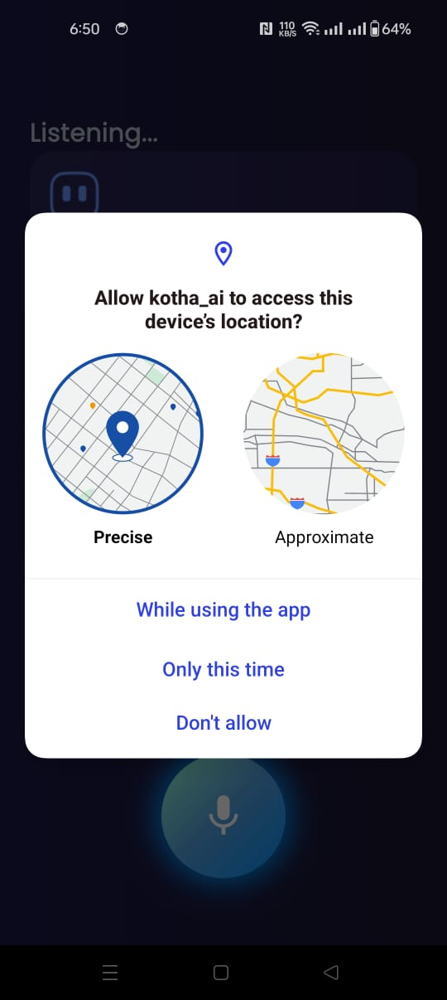
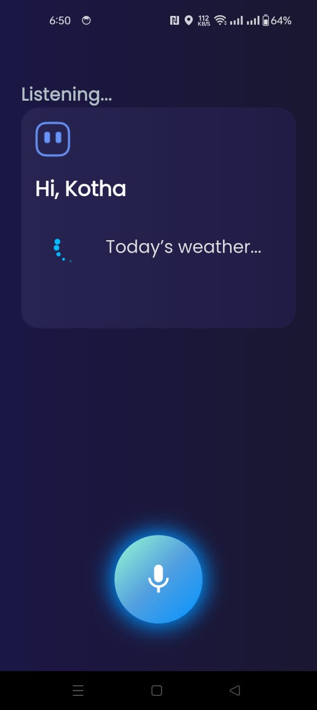
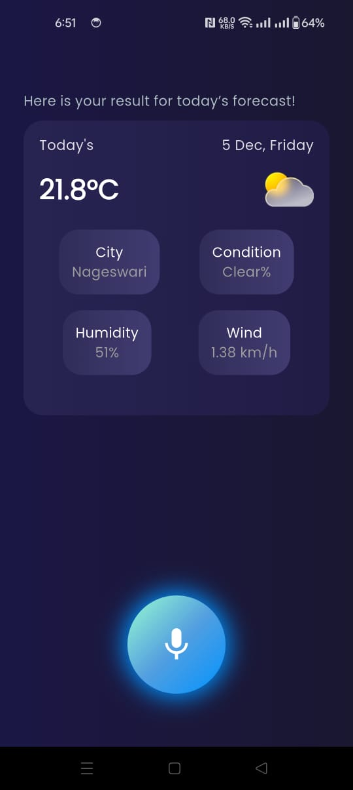
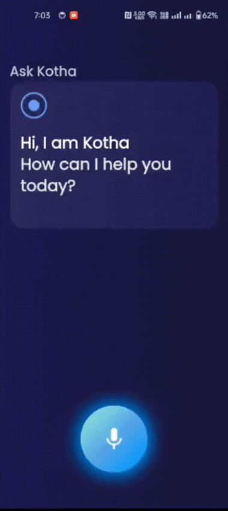

# Kotha AI — Flutter App

[](https://flutter.dev)
[](https://dart.dev)
[](https://riverpod.dev)
[](https://pub.dev/packages/go_router)
[](https://supabase.com)
[](#)
[](LICENSE)

Kotha AI is a voice-enabled smart assistant built with Flutter.
Users can speak naturally, and the app responds with contextual information such as weather, answers, and general assistance.
It features speech-to-text, text-to-speech, real-time weather data, and smooth animated UI screens.

---

## 🚀 Features

🎤 Voice Interaction

- Speech-to-Text for capturing user queries
- Text-to-Speech for AI replies
- Smooth mic button animation
- Live listening preview

🌦️ Weather Assistant

- Detects real-time weather
- Shows city, condition, humidity, and wind
- Auto location fetching (with permission prompt)

📱 Modern UI

- Gradient backgrounds
- Neumorphic card design
- Minimal microphone interface
- Animated responses

🛰️ Location Services
- Precise or approximate location selection
- Integrated Android/iOS permission handling

🧠 AI Interaction
- Smart greeting
- Conversational replies

Event-based navigation (listening → processing → result)
---

## 📸 Screenshots

> Place the `screenshots/` folder in your repo root so these links work on GitHub.

  



---

## 🎥 Demo
<p></p>


## 📝 How It Works
1️⃣ Voice Capture
- User taps mic → STT starts → spoken words convert to text.

2️⃣ AI Processing
- Text is sent to logic/AI handler → generates a response.

3️⃣ Weather Handling
- If query involves weather:
- Location permission appears
- App fetches lat/lon
- Weather API returns temperature, humidity, wind, etc.

4️⃣ Display Response
- Neumorphic card updates with weather or conversational text.

5️⃣ Voice Output
- TTS speaks the result back.

---

## 🚀 Getting Started

### Setup

```bash
# 1) Clone
git clone https://github.com/amhimel/kotha-ai
cd kotha-ai
...

# 2) Install packages
flutter pub get
flutter run
```

### Run
```bash
flutter run
```

---


## 📁 Suggested Folder Structure

```
lib/
 ├── core/          
 ├── Model/            
 ├── Ui/           
 ├── Widgets/        
 ├── services/          
 ├── app.dart        
 └── main.dart       


```

---

## 🗺️ Roadmap

- User profiles
- Multi-language support
- Watchlist & history
- Push notifications
- Full trailer playback


---

## 🤝 Contributing

PRs are welcome!  
If you spot UI/UX tweaks, accessibility fixes, or performance improvements, please open an issue first to discuss the change.

---

## 📝 License

MIT © 2025-12-04 — Kotha AI Contributors
