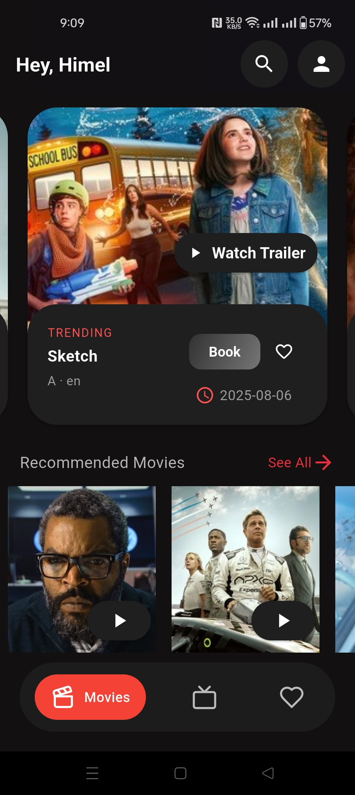
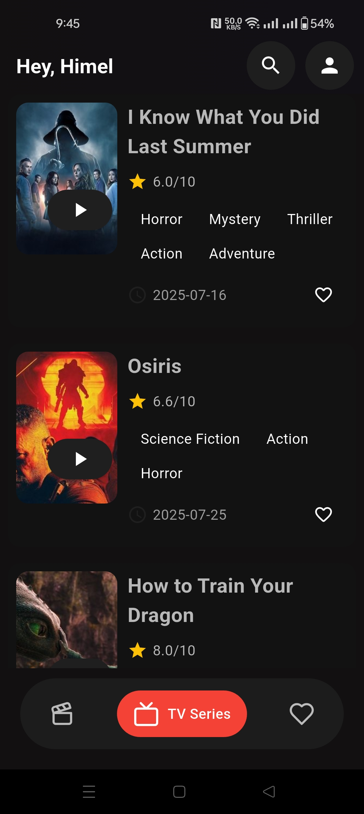
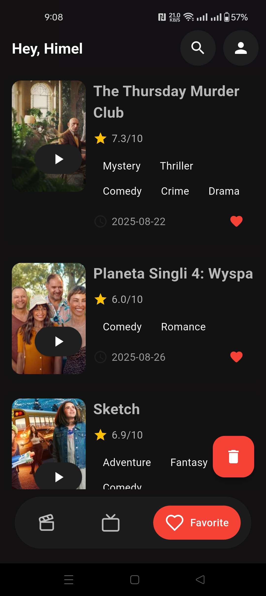
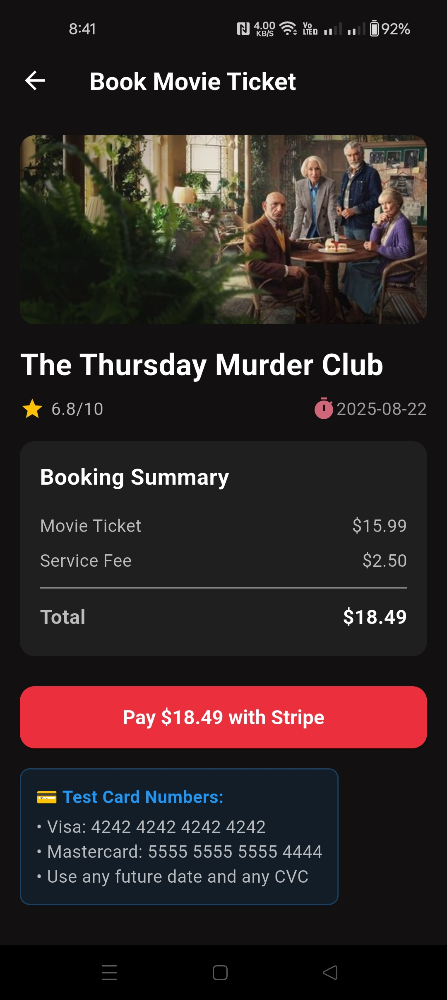

# Movie Verse — Flutter App

[](https://flutter.dev)
[](https://dart.dev)
[](https://riverpod.dev)
[](https://pub.dev/packages/go_router)
[](https://supabase.com)
[](#)
[](LICENSE)

A modern movie-exploration app featuring **trending movies**, **search**, **favorites**, **detailed pages**, and Stripe-powered ticket booking. Movie Verse delivers a visually immersive UI, smooth animations, and a complete end-to-end user experience built with Flutter + **Supabase** + **TMDB API** + **Stripe.**
---

## ✨ Highlights

🎞 Browse Movies

- Trending movies
- Recommended movies
- Categories and genres
- Movie posters, ratings, release dates
- Smooth scrolling UI

❤️ Favorites

- Add/remove movies
- Persistent storage
- Favorites list with icons & badges

🔍 Search

- Live movie search
- Instant keyword filtering
- “No results found” fallback UI

🎬 Movie Details

- High-quality banner
- Genre tags
- Rating, release date
- Overview & storyline
- Add to favorites
- Watch trailer button

🎟 Ticket Booking (Stripe)

- Movie ticket summary
- Service fee calculation
- Stripe checkout (test mode)
- Payment confirmation screen

🌓 Clean, Dark UI Design

- Custom color palette
- Minimalistic layout
- Elevated cards & rounded visuals

---

## 📸 Screenshots

> Place the `screenshots/` folder in your repo root so these links work on GitHub.

  

  

  

---

## 🎥 Demo
<p></p>


## 🧱 Tech Stack

📌 Frontend
- Flutter (Material 3)
- Dart
- Provider / MVVM pattern

📌 Backend
- Supabase (auth, database)

📌 Third-Party APIs
- TMDB API (movie data)
- Stripe (checkout)

📌 Storage
- Local cache for favorites & searches

---

## 🚀 Getting Started

### Prerequisites
- Flutter **3.x** and Dart **3.x**
- A Supabase project (obtain **SUPABASE_URL** and **SUPABASE_ANON_KEY**)
- A TMDB API key (get it from https://www.themoviedb.org/settings/api)
- A Stripe account (for test **STRIPE_PUBLISHABLE_KEY**)


### Setup

```bash
# 1) Clone
git clone https://github.com/<your-org>/<your-repo>.git
cd <your-repo>

# 2) Install packages
flutter pub get
```

Create your env/config (choose the style you prefer):

**Option A — Dart constants**
```dart
// lib/core/env.dart
class Env {
  static const tmdbApiKey = "YOUR_TMDB_KEY";
  static const supabaseUrl = "YOUR_SUPABASE_URL";
  static const supabaseAnonKey = "YOUR_SUPABASE_ANON_KEY";
  static const stripePublishableKey = "YOUR_STRIPE_KEY";
}
```

**Option B — .env (with flutter_dotenv)**
```
SUPABASE_URL=https://YOUR-PROJECT.supabase.co
SUPABASE_ANON_KEY=YOUR_SUPABASE_ANON_KEY
```

Then initialize Supabase early (e.g., in `main.dart`).

### Run
```bash
flutter run
```

---


## 📁 Suggested Folder Structure

```
lib/
 ├── common/          # Shared widgets, buttons, cards
 ├── core/            # Constants, helpers, theme
 ├── data/            # API services, repositories
 ├── features/        # Modules: home, details, search, favorites, booking
 ├── services/        # Stripe, Supabase, TMDB clients
 ├── view_model/      # Providers
 ├── app.dart         # Routes, theme
 └── main.dart        # Entry point


```

---

## 🗺️ Roadmap

- User profiles
- Multi-language support
- Watchlist & history
- Push notifications
- Full trailer playback
- Real Stripe backend (Cloud Functions)

---

## 🤝 Contributing

PRs are welcome!  
If you spot UI/UX tweaks, accessibility fixes, or performance improvements, please open an issue first to discuss the change.

---

## 📝 License

MIT © 2025-12-04 — Movie Verse Contributors
